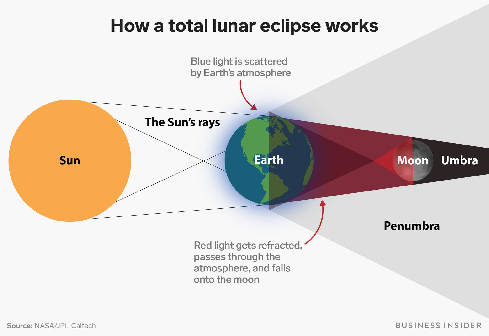
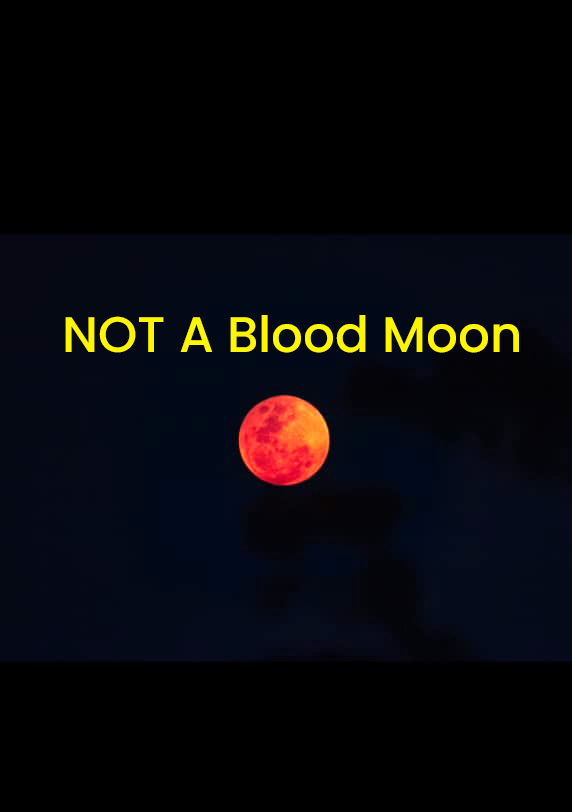

ഇന്നലെ കേരളത്തിൽ ആരും രക്ത ചന്ദ്രനെ കണ്ടിട്ടില്ല !

ജ്യോതിശാസ്ത്രപ്രചാരണത്തിൽ ഏറ്റവും ബുദ്ധിമുട്ടേറിയത് ജ്യോതിഷവും ജ്യോതിശാസ്ത്രവും തമ്മിലുള്ള വ്യത്യാസം ആൾക്കാരെ ബോധ്യപ്പെടുത്തുകയാണെന്ന്  ഞാൻ  കരുതിയിരുന്നു. എന്നാൽ ഇപ്പോൾ അതിനേക്കാൾ വലിയൊരു ബുദ്ധിമുട്ട് നേരിടുകയാണ്. പണ്ടെങ്ങുമില്ലാത്ത തരത്തിൽ ജ്യോതിശാസ്ത്രത്തിന്, പ്രത്യേകിച്ച് വാന നിരീക്ഷണത്തിന്, വലിയ പ്രചാരം ഇന്ന് ലഭിക്കുന്നുണ്ട്. ഒരു ജ്യോതിശാസ്ത്ര പ്രചാരകൻ എന്ന നിലയിൽ അതിലെനിക്ക്  ഒരുപാട് സന്തോഷവുമുണ്ട്. പക്ഷേ, പോപ്പുലാരിറ്റി കൂടിയപ്പോൾ തെറ്റിദ്ധരിപ്പിക്കുന്നതും, തെറ്റായതുമായ വാർത്തകളും റീലുകളും ധാരാളമായി വന്നു തുടങ്ങി.  ചിലപ്പോഴെങ്കിലും ഇതൊക്കെ കാണുമ്പോൾ “ഇത്രയും പോപ്പുലാരിറ്റി വേണ്ടിയിരുന്നില്ല” എന്നു തോന്നാറുണ്ട്. കൂടുതൽ വായിച്ചു മനസ്സിലാക്കാതെ, പഠിക്കാതെ, കിട്ടുന്ന കുറച്ചു  വിവരങ്ങൾ മാത്രം അടിസ്ഥാനമാക്കിയാണ് പലരും ജ്യോതിശാസ്ത്ര വാർത്തകൾ  പ്രചരിപ്പിക്കുന്നത്.

2023ൽ  പേഴ്‌സിഡ്  ഉൽക്കവർഷത്തിലാണ് ഇത് ആദ്യമായി ഞാൻ ശ്രദ്ധിക്കുന്നത്.  അന്ന്  വിക്ടേഴ്‌സ് ചാനലിൽ അശ്വിൻ ശേഖർ നൽകിയ ഒരു അഭിമുഖത്തിൽ അദ്ദേഹം ആ വർഷം വരാൻ പോകുന്ന പേഴ്‌സിഡ് ഉൽക്കവർഷത്തെ കുറിച്ച് പറഞ്ഞിരുന്നു.  പിന്നീട്  അഭിമുഖത്തിന്റെ ഈ ഒരു ഭാഗം മാത്രം റീല് ആയി വിക്ടേഴ്സിന്റെ Instagram പേജിൽ വന്നു.   ഒട്ടും അതിശയോക്തി ഇല്ലാതെ കൃത്യമായി കാര്യങ്ങൾ പറഞ്ഞ ആ റീൽ വൈറൽ ആയി.  വൈറൽ കണ്ടന്റ് ആയപ്പോൾ പലരും വ്യൂസ് കിട്ടാൻ വേണ്ടി മാത്രം ഇതേക്കുറിച്ചു റീലുകൾ ചെയ്തു.  അതിൽ മിക്ക റീലുകളും വേണ്ടത്ര പഠനം ഇല്ലാതെ, പെട്ടെന്ന് റീച് കൂട്ടാൻ വേണ്ടി , തെറ്റിദ്ധരിപ്പിക്കുന്നതും തെറ്റായതുമായ ക്ലിക്ക് ബൈറ്റുകളും, ഹുക്കുകളും ഒക്കെ ചേർന്നതായിരുന്നു.  ഇന്നേ വരെ സയൻസ് കണ്ടന്റ് ചെയ്തിട്ടില്ലാത്തവർ പോലും ഇങ്ങനെ റീച്ചിന് വേണ്ടി മാത്രം ഈ വിഷയത്തിൽ റീലുകൾ ചെയ്തു. ( ഇന്നേവരെ സയൻസ് കണ്ടന്റ് ചെയ്യുന്നവർ മാത്രമേ ഇത് ചെയ്യാവൂ എന്നോ അങ്ങനെ ചെയ്ത എല്ലാരും തെറ്റായി ചെയ്തു എന്നോ അല്ല!). അങ്ങനെ സംഗതി മൊത്തത്തിൽ വൈറൽ ആയപ്പോൾ ഓൺലൈൻ വാർത്ത ചാനലുകളും ഒപ്പം മുഖ്യധാരാ മാധ്യമങ്ങളും ഇതിനെ ഏറ്റെടുത്തു.  വന്ന വാർത്തകളും റീലുകളിലും മിക്കതും ഏതാണ്ടിങ്ങനെ ഒക്കെയായിരുന്നു. "ആഗസ്ത് മാസം ആകാശത്തു നിന്ന് തീ മഴ പെയ്യും", " വരുന്നു ആകാശത്തെ തൃശൂർ പൂരം". ഹുക്ക് പോയിന്റുകളോ ടൈറ്റിലുകളോ മാത്രം ആയിരുന്നില്ല പ്രശ്‌നം ഇതെങ്ങനെ കാണണം എന്നോ ആ സമയത്തെ കാലാവസ്ഥയെ കുറിച്ചോ എന്താണ് കൃത്യമായി കാണുക എന്നതോ ഒന്നും മിക്ക കണ്ടന്റുകളിലും ഉണ്ടായിരുന്നില്ല. പക്ഷെ ഉൽക്കവർഷത്തിന്റെ ദിവസം കേരളത്തിൽ മിക്കയിടത്തും മഴക്കാർ ആയിരുന്നതിനാൽ ഭൂരിഭാഗം പേർക്കും ഉൽക്കാവർഷം  കാണാൻ കഴിഞ്ഞില്ല.  (മഴക്കാർ ഇല്ലാത്ത സ്ഥലം തപ്പി ഞാനും എന്റെ സുഹൃത്ത് അതുലും കൂടി പോയി എടുത്ത ഉൽക്കവർഷത്തിന്റെ ചിത്രം പിറ്റേ ദിവസം പത്രങ്ങളിലും ചാനലിലും ഒക്കെ വന്നു. അതെന്നെ ഒന്ന് വൈറൽ ആക്കിയിരുന്നു ).   പിറ്റേന്ന് കേരളത്തിൽ ആകാശം കുറേക്കൂടി തെളിഞ്ഞതായിരുന്നു.  എന്നാൽ പിറ്റേ ദിവസവും ഇത് കാണാൻ കഴിയും എന്ന് ഈ റീലുകാർ മിക്കവരും പറഞ്ഞു കൊടുത്തിരുന്നില്ല. അതുകൊണ്ട് തന്നെ രണ്ടാം ദിവസത്തെ കാഴ്ച പലരും നഷ്ടപ്പെടുത്തി.  അടുത്ത ദിവസം ഇതേ റീലുകാർ പിറ്റേന്ന് കാണാൻ കഴിയാതെ പോയതിനെ കളിയാക്കി ആകാശം നോക്കി കഴുത്തുപോയി, ജ്യോതീം വന്നില്ല തീയും വന്നില്ല എന്നൊക്കെ പറഞ്ഞ് അതും ഒരു കണ്ടന്റ് ആക്കി.

ഉൽക്കാവർഷം മാത്രമല്ല മറ്റു പല ആകാശക്കാഴ്ച്ചകളും ഇങ്ങനെ തെറ്റിദ്ധരിക്കപ്പെട്ട്  പോയിട്ടുണ്ട്.

എല്ലാവർഷവും "അത്യപൂർവ പ്രതിഭാസം" ആയി വരുന്ന മറ്റൊരാളുണ്ട് - സൂപ്പർ മൂൺ.  ചന്ദ്രൻ ഭൂമിയോട് അടുത്തുവരുമ്പോൾ ഉണ്ടാവുന്ന പൂർണ്ണചന്ദ്രനെയാണ് സൂപ്പർ മൂൺ എന്ന് വിളിക്കുക. സാധാരണ പൂർണ്ണചന്ദ്രനെക്കാൾ ഇതിന് 7% വലിപ്പക്കൂടുതലുണ്ടാവും. ഈ വലിപ്പ വ്യത്യാസം നിരീക്ഷിച്ചാൽ  നമുക്ക് മനസിലാവില്ല. ടെലിസ്കോപ്പിലൂടെ നോക്കിയാലും വലിപ്പക്കൂടുതൽ അറിയില്ല. പക്ഷെ പല റീലുകളിലും വാർത്തകളിലും നമ്മൾ ഇത് കാണില്ല പകരം "ഇന്ന് കാണാം സൂപ്പർ മൂൺ" , "ഈ വർഷത്തെ അവസാനത്തെ സൂപ്പർ മൂൺ", "ചന്ദ്രൻ ഇന്ന് പതിവിലും വലിപ്പത്തിൽ"  ഇങ്ങനെ ഒക്കെ ആവും വാർത്തകൾ. ഫോട്ടോ എടുത്ത് മറ്റൊരു സാധാരണ പൂർണ്ണചന്ദ്രനുമായി താരതമ്യം ചെയ്ത് നോക്കിയാലേ ഈ വലിപ്പക്കൂടുതൽ മനസിലാകൂ എന്ന് പലപ്പോളും കണ്ടന്റുകളിൽ കാണില്ല. പക്ഷെ  ഇതൊക്കെ കേട്ട് സൂപ്പർ മൂണിനെ കാണാൻ പോകുന്നവർ സൂപ്പർ മൂണിനെ കാണും - അതും പതിവിലും വലിപ്പത്തിൽ താന്നെ!

സംഗതി ഒരു optical illusion ആണ്. ചന്ദ്രൻ, സൂര്യൻ ഇവയൊക്കെ ചക്രവാളത്തിനോട് അടുത്തായിരിക്കുമ്പോൾ അവയുടെ വലിപ്പം കൂടുതലായി നമുക്ക് തോന്നും. നമ്മുടെ തലച്ചോറിന്റെ കളിയാണിത്. ഇത് അനുഭവിക്കാൻ ഏതു ദിവസത്തെ ചന്ദ്രനെ കണ്ടാലും മതി.  ഈ വലിപ്പക്കൂടുതൽ നക്ഷത്ര ഗണങ്ങളിലും നമുക്ക് അനുഭവിക്കാൻ കഴിയും. പക്ഷെ സൂപ്പർ മൂൺ ദിവസം ഈ Optical Illusion കണ്ടു  അത് സൂപ്പർ മൂൺ തന്നെയാണെന്ന് മിക്കവരും ഉറപ്പിക്കുന്നു.

ഇതിൽ ഏറ്റവും രസകരമായത് ബ്ലാക്ക് മൂൺ ആണ്. ഒരു കലണ്ടർ മാസത്തിലെ രണ്ടാമതൊരു അമാവാസി (Newmoon) ഉണ്ടായാൽ ആ രണ്ടാമത്തെ അമാവാസിയെ വിളിക്കുന്ന ഒരു പേര് മാത്രമാണ് ബ്ലാക്ക് മൂൺ. (സീസണുകളെ അടിസ്ഥാനമാക്കിയും നിർവചനവും ഉണ്ട് ). പേരിനപ്പുറം, ജ്യോതിശാസ്ത്രപരമായി ഇതിന് മറ്റു പ്രത്യേകതകൾ ഒന്നുമില്ല, ഒരു അമാവാസി അത്രയേ ഉള്ളൂ. എന്നാൽ ഇത് മനോരമ ഒരിക്കൽ റിപ്പോർട്ട് ചെയ്തത് അത്യപൂർവമായ ജ്യോതിശാസ്ത്ര പ്രതിഭാസം എന്നാണ്. പതിവിലും ഇരുട്ട് കൂടുതലാവും കൂടുതൽ കറുത്ത രാത്രി എന്നൊക്കെയായിരുന്നു എഴുതിവിട്ടിരുന്നത്.

ചന്ദ്രനെ സംബന്ധിച്ച്  ഇനിയും ഉണ്ട് - ബ്ലൂ മൂൺ, സ്ട്രോബെറി മൂൺ അങ്ങനെ പോകുന്നു.

ഈയിടെ വന്ന മറ്റൊരു വാർത്തയായിരുന്നു  ഫെബ്രുവരി 28-ന് ആകാശത്ത്  ആറു  ഗ്രഹങ്ങളെ ഒന്നിച്ചു കാണാം എന്നത്.  സാങ്കേതികമായി സംഗതി ശരിയാണ്. ബുധൻ, ശുക്രൻ, ശനി, വ്യാഴം, യുറാനസ്, നെപ്റ്യൂൺ  (Mercury, Venus, Saturn, Jupiter, Uranus, and Neptune)  ഇവരെല്ലാം ഫെബ്രുവരി 28 ന്  ആകാശത്തുണ്ട് (27 നും 1നും എല്ലാം ഇവർ ആകാശത്തുണ്ട് ).  മാത്രമല്ല ഇതിൽ ഏതൊക്കെ വെറും കണ്ണ് കൊണ്ട് കാണാം എന്നും പലപ്പോഴും പറയില്ല.  യുറാനസും നെപ്റ്യൂണും ടെലിസ്‌കോപ്പ് ഉണ്ടെങ്കിൽ മാത്രം കാണാൻ കഴിയുന്നവയാണ് ( എങ്കിൽ തന്നെ അത്ര എളുപ്പമല്ല ). ഇനി ഇതിൽ ബുധനെ കാണാൻ നല്ല പ്രയാസമാണ്. വളരെ മങ്ങിയും സൂര്യനോട് അടുത്തുമാണ് ബുധൻ ഉണ്ടായിരുന്നത്.  മറ്റൊരു പ്രശ്‌നം  ഇതിനൊക്കെ ഒപ്പം ഉപയോഗിക്കുന്ന ഗ്രാഫിക്സ് ആണ്.  ഗ്രഹങ്ങളുടെ ഒക്കെ അതിമനോഹരമായ, മിനിമം ഹബിൾ എടുത്ത,  ചിത്രങ്ങൾ എങ്കിലും ആകാശത്തു നിരത്തി വെച്ചിട്ടുണ്ടാകും. ചിത്രങ്ങളിൽ കാണുന്നത് പോലെ കാണാൻ ടെലിസ്‌കോപ്പ് ഉണ്ടെങ്കിൽ പോലും ഒരിക്കലും സാധിക്കില്ല എന്നതാണ് സത്യം. ഇങ്ങനെ ഉള്ള വാർത്തകൾ കണ്ട്  നിരീക്ഷണ പരിപാടികൾക്ക് വന്ന്  നിരാശരായി മടങ്ങുന്നവരെ പലപ്പോളും കാണാറുണ്ട്.

ഇപ്പോൾ ഇത് എഴുതാൻ  കാരണം ഇന്നലെ(മാർച്ച് 3 നു)  കേരളത്തിൽ ഉണ്ടായ ഭാഗിക ചന്ദ്ര ഗ്രഹണമാണ്. എന്താണ് ഒരു പൂർണ ചന്ദ്രഗ്രഹണം എന്ന് നോക്കാം.  ഭൂമി സൂര്യൻ നിൽക്കുന്നതിന്റെ എതിർവശത്തേക്ക് രണ്ട് തരത്തിൽ ഉള്ള നിഴലുകൾ ഉണ്ടാക്കുന്നുണ്ട്. ഒരു പൂർണ നിഴലും(Umbra) ഒരു ഭാഗിക നിഴലും(Penumbra). പൂർണ്ണ ഗ്രഹണ സമയത്ത്,   ഭൂമിയുടെ നിഴൽ ചന്ദ്രനിൽ പതിക്കുമ്പോൾ ആദ്യം പതിക്കുക ഭാഗിക നിഴൽ ആയിരിക്കും. അത് കഴിഞ്ഞാണ് പൂർണ്ണ നിഴൽ പതിക്കുക. ചിത്രം കാണുക.  ഈ പൂർണ നിഴലിലേക്ക് ചന്ദ്രന്റെ പകുതിയിലേറെ എങ്കിലും കടക്കുമ്പോഴാണ് ചന്ദ്രൻ ചുവന്ന് തുടങ്ങുന്നത്. നിഴൽ പൂർണമായും ചന്ദ്രനിൽ പതിക്കുന്നതോടെ ചന്ദ്രൻ ഒരു ചുവന്ന ചന്ദ്രനായി മാറുന്നു.  ഇതാണ് രക്ത ചന്ദ്രൻ എന്ന പേരിൽ അറിയപ്പെടുന്ന പ്രതിഭാസം. ഭൂമിയുടെ അന്തരീക്ഷത്തിലൂടെ അപവർത്തനം നടന്ന് ചന്ദ്രനിലെത്തുന്ന പ്രകാശം ആണ് ഇതിനു കാരണം ആവുന്നത്. ഇങ്ങനെ ഭൗമാന്തരീക്ഷത്തിലൂടെ കടന്നു വരുന്ന പ്രകാശത്തിൽ ചുവപ്പ്  ഒഴികെ, തരംഗ ദൈർഖ്യം കുറഞ്ഞ, ബാക്കിയെല്ല നിറങ്ങളും നഷ്ടമായിട്ടുണ്ടാവും. അങ്ങനെ ഈ ചുവപ്പ് പ്രകാശമാണ് ചന്ദ്രനെ ചുവപ്പിക്കുന്നത്. അതായത് ചന്ദ്രൻ പൂർണമായും ചുവന്ന് കാണണം എങ്കിൽ പൂർണ്ണ ചന്ദ്രഗ്രഹണം ആവശ്യമാണ്.  എന്നാൽ ഇന്നലെ കേരളത്തിൽ നിന്നും ഭാഗിക ഗ്രഹണം മാത്രമായിരുന്നു ദൃശ്യമായത്.  അതും ചന്ദ്രോദയ സമയത്ത് ചന്ദ്രന്റെ ഒരു അരികിൽ മാത്രമായിരുന്നു പൂർണ്ണ നിഴൽ ഉണ്ടായിരുന്നത്. അത് 6.45നു അവസാനിക്കുകയും ചെയ്തു.  അതിനു ശേഷം ചന്ദ്രനിൽ ഉണ്ടായിരുന്നത് ഭാഗിക നിഴൽ മാത്രമാണ്.  ഈ ഭാഗിക നിഴൽ വീഴുന്നത് നമുക്ക് കണ്ണ് കൊണ്ട് തിരിച്ചറിയാനും ബുദ്ധിമുട്ടാണ്. പ്രത്യേകിച്ച്  ചന്ദ്രോദയ സമയം കൂടിയാണ്. അതായത് കേരളത്തിൽ ഇന്നലെ ആരും തന്നെ പൂർണ്ണ ഗ്രഹണം കണ്ടിട്ടില്ല. രക്ത ചന്ദ്രനെയും കണ്ടിട്ടില്ല.   അപ്പോൾ പിന്നെ ഇന്നലെ പലരും കണ്ടെന്ന് അവകാശപ്പെടുന്ന, പലരുടെയും സ്റ്റാറ്റസുകളിൽ കണ്ട,  ആ ചുവന്ന ചന്ദ്രൻ എന്താണ്. ചന്ദ്രനും സൂര്യനും ഉദയ സമയത്തും അസ്തമയ സമയത്തും ചുവന്നിരിക്കും. ഇതിൽ സൂര്യന്റെ കാര്യം നമ്മൾ എല്ലാവരും ശ്രദ്ധിച്ചിട്ടുണ്ടാവും. ചന്ദ്രനും ഇത് സംഭവിക്കുന്നുണ്ട്. ചന്ദ്രന്റെ പ്രകാശം അന്തരീക്ഷത്തിലൂടെ കൂടുതൽ ദൂരം സഞ്ചരിച്ചു വരുമ്പോൾ ചുവപ്പും ഓറഞ്ചും മഞ്ഞയുമൊക്കെയേ അവശേഷിക്കൂ ഇതാണ് ചുവന്ന അല്ലെങ്കിൽ ഓറഞ്ച് നിറത്തിന് കാരണം.  പിന്നെ ഫോട്ടോ എടുക്കുമ്പോൾ white balance ഒരു 6000 നു മുകളിലേക്ക് വച്ചാൽ കൂടുതൽ ചുവന്നും കിട്ടും.

ഇങ്ങനെ എടുത്തതാണ് ഇന്നലെ കണ്ട ചിത്രങ്ങൾ എല്ലാം. അടുത്ത മാസത്തെ പൂർണ്ണ ചന്ദ്രനെയും ഉദയ സമയത്തോ അസ്തമയ സമയത്തോ നോക്കിയാലും നിങ്ങൾക്ക് ഇതേ പ്രതിഭാസം കാണാം. പിന്നെ ഭാഗിക നിഴൽ ഉണ്ടായിരുന്നതിനാൽ ഇന്നലെ ആ ഓറഞ്ച് നിറം കുറച്ചു കൂടുതൽ ഉണ്ടായിരുന്നിരിക്കാം. എന്നിരുന്നാൽ പോലും അത് ബ്ലഡ് മൂൺ അല്ല. ഇന്നലെയെടുത്ത ചന്ദ്രന്റെ ചിത്രമല്ല ഇവിടെ പ്രശനം അത് പൂർണ്ണ ഗ്രഹണ സമയത്തു  മാത്രം ഉണ്ടാവുന്ന ബ്ലഡ് മൂൺ എന്ന പ്രതിഭാസമാണെന്ന് കരുതി പ്രചരിപ്പിക്കുന്നതാണ്.

ആകാശത്തിലെ ഇത്തരം പ്രതിഭാസങ്ങൾ  കാണാൻ ആഗ്രഹിക്കുന്നവരോടാണ്. നമ്മൾ കാണുന്ന സ്ഥലം സമയം ഇതൊക്കെ അനുസരിച്ചാണ് മിക്ക ജ്യോതിശാസ്‌ത്ര പ്രതിഭാസങ്ങളും. പിന്നെ കാലാവസ്ഥ കൂടി നന്നാവണം. ഇതിലെല്ലാം ഉപരി നല്ല ക്ഷമ വേണം. കൂടുതൽ നന്നായി കാണാൻ പലപ്പോഴും കണ്ണ് ഒരുപാട് സമയം ഇരുട്ടത്ത് ഇരിക്കണം. അങ്ങനെ പലതുണ്ട്.  എന്തെങ്കിലും ഉണ്ടെന്നറിഞ്ഞാൽ റീലുകളും കാർഡുകളും ഷെയർ ചെയ്യും മുൻപ് കുറച്ചു കൂടുതൽ അതിനെക്കുറിച്ചു വായിക്കാനും പഠിക്കാനും ശ്രമിക്കുക. വാനനിരീക്ഷണത്തിന്റ ഭംഗി അതിനെക്കുറിച്ചുള്ള അറിവിനൊപ്പം കൂടയുന്നതാണ് എന്ന് കാൾ സാഗൻ  പറഞ്ഞിട്ടുണ്ട്.

Knowing the science behind what you’re seeing deepens the beauty rather than diminishing it.

മലയാളത്തിൽ ഇക്കാര്യത്തിൽ വിശ്വസിച്ചു  വായിക്കാൻ കഴിയുന്നത് കേരള ശാസ്ത്ര സാഹിത്യ പരിഷത്തിന്റെ ലൂക്ക എന്ന സയൻസ് പോർട്ടലിൽ  ആണ് ([https://luca.co.in/](https://luca.co.in/?fbclid=IwZXh0bgNhZW0CMTAAYnJpZBExaXloRjVtS2wwRk1CWGRUZ3NydGMGYXBwX2lkEDIyMjAzOTE3ODgyMDA4OTIAAR6hlGc4VfNCRfhLEZObE9E-vlcb7BNaqT5YSeHyAD1QumHK_tk1CujAZ5tPGQ_aem_YMi2iWsfNWt5K6iui3tClA)). 2026 ലെ,  മുൻകൂട്ടി അറിയാൻ കഴിയുന്ന,  ആകാശക്കാഴ്ചകളെക്കുറിച്ച് അതിൽ ഇപ്പോൾ തന്നെ വായിക്കാം. മാത്രമല്ല എല്ലാ മാസത്തേയും ആകാശ വിശേഷങ്ങൾ  അതിൽ വരാറുമുണ്ട്.

[timeanddate.com](timeanddate.com)  ഞാൻ സ്ഥിരമായി ഉപയോഗിക്കുന്ന മറ്റൊരു വെബ്‌സൈറ്റാണ്.

 “രാത്രിയിൽ കോസ്മിക് രശ്മികൾ വരും, അതിനാൽ ഫോൺ ഓഫ് ചെയ്യണം” എന്ന് പറഞ്ഞ കേശവൻ മാമന്മാരെ നമ്മൾ കളിയാക്കിയിരുന്നു. എന്നാൽ ഇന്ന് നമ്മളും ചെയ്യുന്നത് ഏറെക്കുറെ അതെ കാര്യങ്ങൾ തന്നെയാണ്. അന്ന് ഒന്നുമില്ലെങ്കിൽ  പെട്ടെന്ന് കാര്യങ്ങൾ സേർച്ച് ചെയ്ത നോക്കാൻ കഴിഞ്ഞിരുന്നില്ല എന്നെങ്കിലും പറയാം. മാത്രമല്ല അന്നവർ മിനിമം ചന്ദ്രോദയം കണ്ടിരുന്നു എന്നെങ്കിലും ഏറെക്കുറെ ഉറപ്പാണ്.

എല്ലാവർക്കും തെളിഞ്ഞ ആകാശം നേർന്നു കൊണ്ട്
